# EntertainmentHub – Third Sprint
Project made by Lizeth Consuelo Bañuelos Ruelas.

# Description
Entertainment Hub is an entertainment platform where you can watch movies, TV shows, upcoming movies, top-rated and popular movies. It also features a simulated login while we add a database.

# Objectives
- Implement asynchronous functionalities in the Angular project.
- Use the **rxjs** library.
- Perform unit testing on the functionalities.

# Dependencies and Libraries
- **Angular**: v17.3.11
- **Node**: v20.11.0
- **npm**: v10.2.4
- **TypeScript**: v5.4.2
- **PrimeNG**: v17.18.3

# Project Screenshots
  
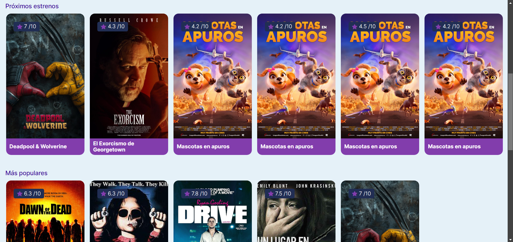  
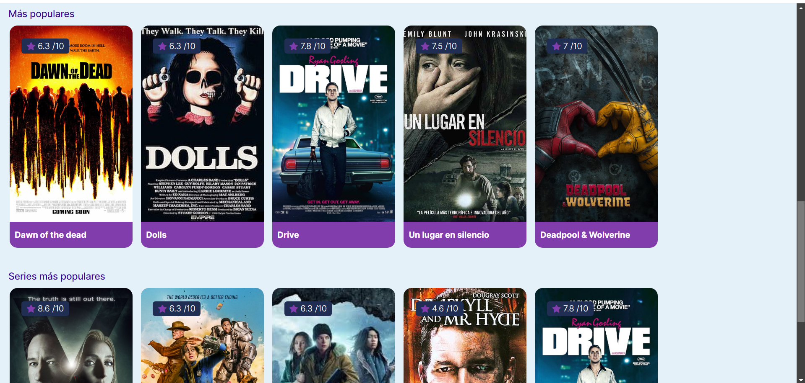  
  
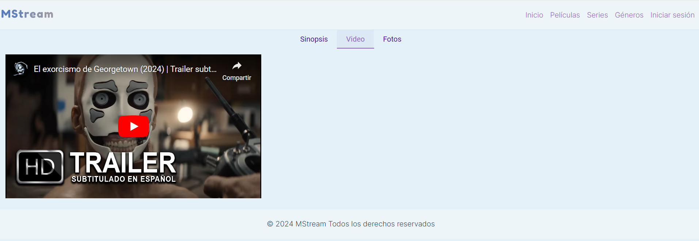  
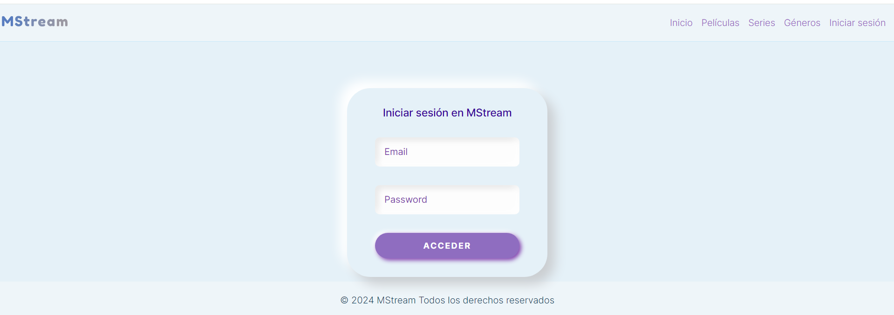  

## Responsive View
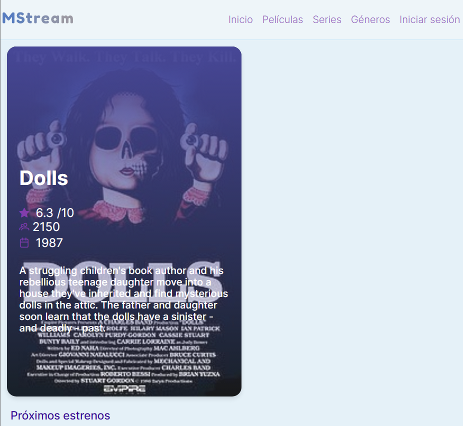  
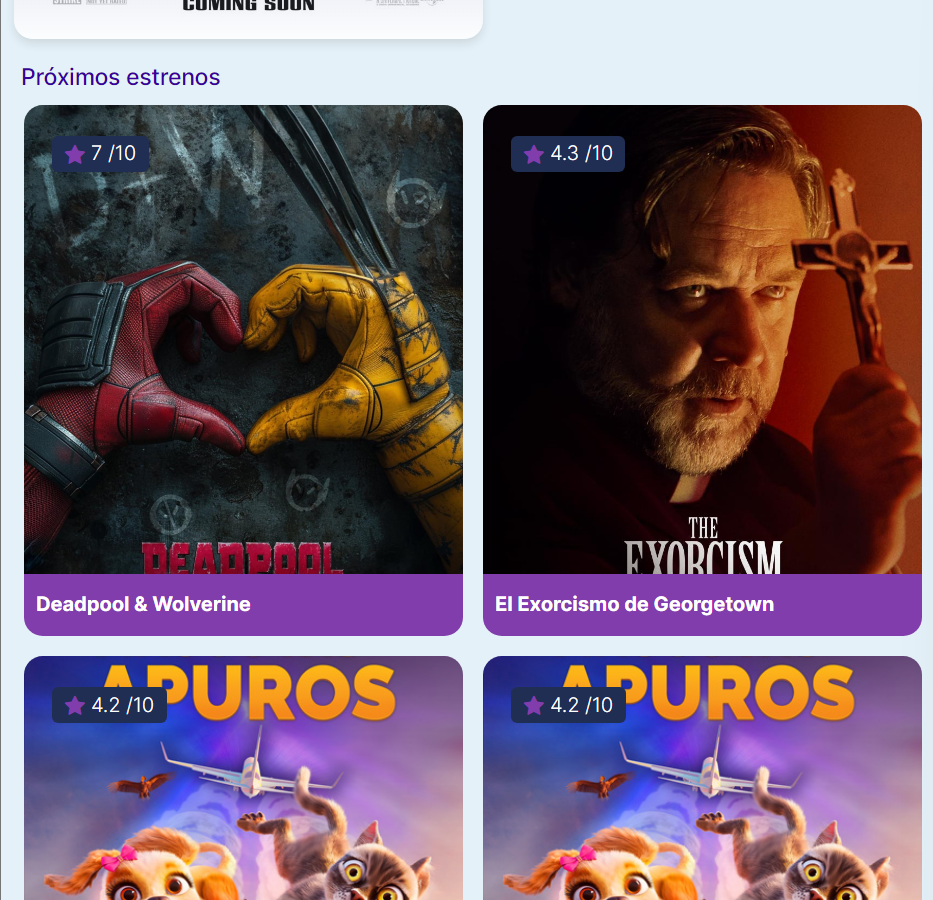  
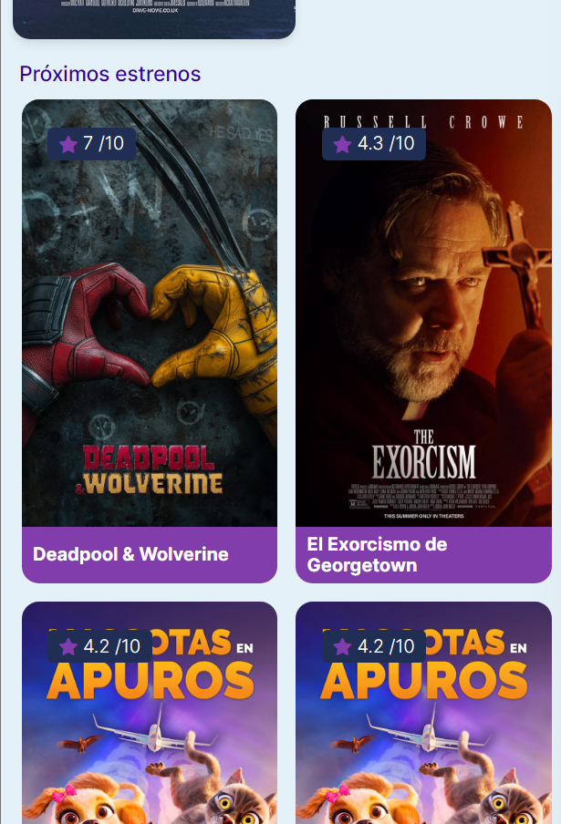  
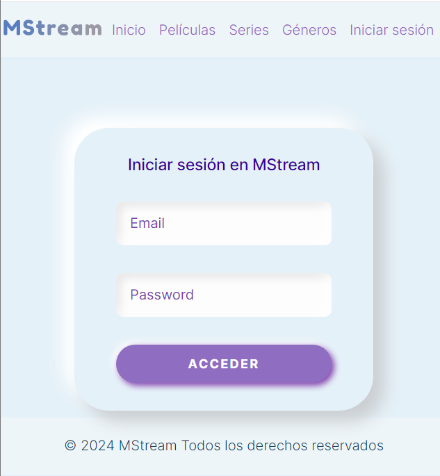  
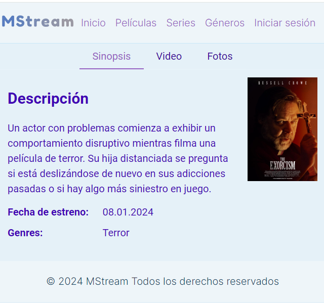  

# Instructions
1. Download the ZIP file.
2. Unzip the ZIP file.
3. Open your favorite IDE.
4. If you don’t have Node.js installed, go to [nodejs.org](https://nodejs.org) to download it.
5. Select **File > Open Folder** and find the unzipped folder. Click on it and open it.
6. Open a terminal in your IDE.
7. In the root of the project, run the command `npm install` to install the dependencies.
8. Once the dependencies are installed, run the command `ng serve` to start the Angular project. Wait until it compiles, then open your browser and go to the given address.

# How It Was Made
To start the project, I first reviewed different platforms and designs on the web for movie platforms to get an idea of how to create my own. However, I noticed that many looked similar, so I needed to add key details to differentiate mine and learn more about interface design.

Once I had a clearer idea, I searched for videos on Angular since it was new to me, as were unit tests (I had only made projects before without testing). I looked for e-commerce examples since I could implement them similarly and understand component development.

I began by developing components like the header, logo, and footer. Then I created a JSON file with movies to simulate a database. Filters and attributes for movies were added as needed for filtering.

Additionally, I researched testing on different websites, focusing on practical examples to implement in my project for functions like filtering movies, among others.

# Code Coverage & Testing Report
## Code Coverage
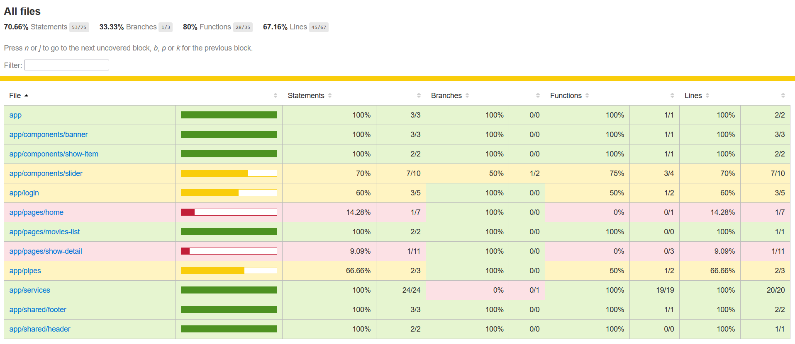  
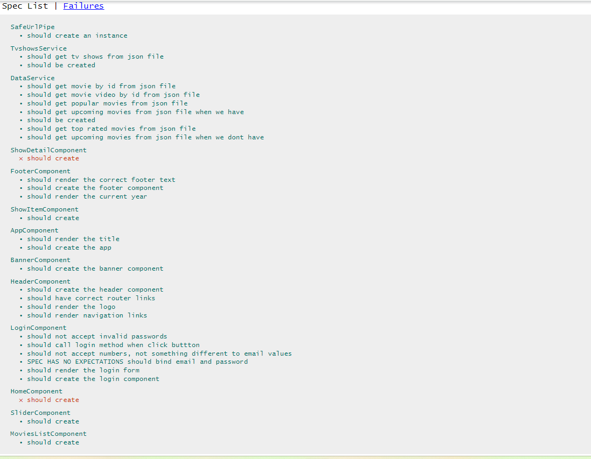  

# Known Issues
- YouTube video links in the movie’s “video” tab.
- The image sizes in the movie descriptions look inconsistent.
- The URL pipe test still needs to be done, as I had not used it before. This requires further research or asking for help.

# Retrospective

## ✅ What went well?
- Learning to use Angular, PrimeFlex for responsiveness, and PrimeNG.

## ⚠️ What didn’t go well?
- The “slider” component didn’t turn out how I wanted, and it doesn’t look good in responsive view. I’m considering whether to keep it or replace it.
- UI needs improvement.
- Testing YouTube links — it’s my first time working with them.
- Adding the “Add to Favorites” function — I focused on other features instead.

## 💡 What can I do differently?
- Create better tests for functionalities.
- Implement “Add to Favorites” with an icon.
- Clearly define how I want to develop the home interface.
- Better understand how to filter by genres for the next sprint so I can finish my header and its components.
- Add TV show descriptions.
- Use a single JSON file to simulate a database for both series and movies (currently, they’re separate).
- Focus on the “Add to Favorites” feature.

# Unit Testing
To run the unit tests, open the terminal and type the command `ng test` and to get the code coverage type the command `ng test --code-coverage`.
