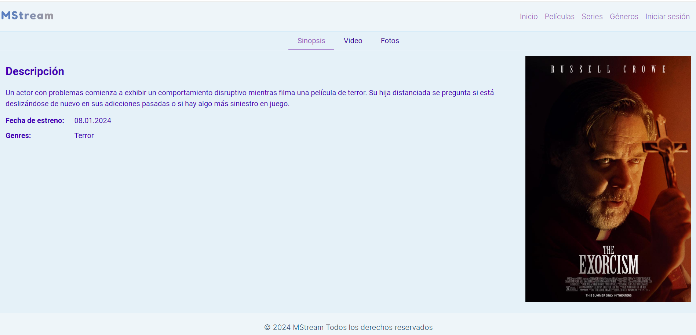

# EntertainmentHub - Tercer Sprint
Proyecto hecho por Lizeth Consuelo Bañuelos Ruelas.

# Descripción
Entertainment Hub entretenimiento donde se pueden ver películas, programas de televisión, las próximas películas, las películas más valoradas y populares, también tiene un inicio de sesión simulado mientras agregamos una base de datos

# Objetivos
- Implementar funcionalidades asíncronas en el proyecto angular.
- Utilizar la biblioteca rxjs.
- Realizar pruebas unitarias a las funcionalidades.

# Dependencias y bibliotecas
Angular: v17.3.11
Node: v20.11.0
npm : v10.2.4
Typescript: v5.4.2
primeng: v17.18.3

# Captura de pantalla del proyecto

## En responsive

# Instrucciones
- Descarga el archivo ZIP
- Descomprime el archivo ZIP
- Abre tu IDE favorito
- Si no tienes instalado Node.js, ve a nodejs.org para descargarlo.
- Seleccione "Archivo" > "Abrir carpeta" y busque la carpeta que descomprimió. Luego haga clic en la carpeta y ábrala.
- Abre una terminal en tu IDE.
- En la raíz del proyecto, ejecute el comando `npm install` para instalar las dependencias.
- Una vez que tengas las dependencias instaladas ejecuta el comando `ng save` para iniciar el proyecto Angular y espera hasta que se compile para abrir tu navegador e ir a la dirección.

# Descripción de como se hizo
Para comenzar el proyecto primero se estuvieron revisando diferentes plataformas y diseños en la web sobre plataformas de películas, para obtener una idea de cómo elaborar una propia, sin embargo me di cuenta de que muchas se parecían y tendría que poner detalles clave para diferenciarlas y aprender más sobre diseño de interfaces.
Una vez se llegó a una idea más clara, se procedió a buscar videos sobre Angular ya que es algo nuevo para mi al igual que las pruebas unitarias (solo había realizado los proyectos pero no con testing). Busqué ejemplos sobre ecommerce ya que podría realizarlos de esa manera y ver la implementación y desarrollo de los componentes.
Luego, comencé a desarrollar componentes como el header, el logo, el footer, posterior a eso se creó un json con películas para poder simular una base de datos, se crearon filtros y atributos para las películas conforme se necesitaban para filtrar las películas.
En adición a lo anterior, se investigó sobre testing en distintos páginas web sobre todo ejemplos prácticos para lograr implementarlas en mi proyecto en las funciones qeu filtran películas, entre otras.

# Reporte de Code Coverage y de testing
##Code coverage

# Problemas conocidos
Los links de videos de Youtube en la pestaña video de las películas.
El tamaño de las imágenes en las descripciones de las películas se ven diferentes.
El test del pipe del url es necesario hacerlo ya que no lo había manejado antes. Se debe investigar o preguntar.

# Retrospectiva

## ¿Qué hice bien?
Aprender a manejar Angular, primeflex para que sea responsive así como primeng,

## ¿Qué no salió bien?
El componente "slider" no quedó como me gustaría y para el responsive no se ve adecuado, por lo que aún se piensa si es necesario dejarlo o cambiarlo a otro mejor hecho.
Se requiere mejorar la UI.
Realizar el test de los links de youtube ya que es la primera vez que lo manejo.
Agregar la función añadir a favoritos ya que me enfoqué en otras funciones.

## ¿Qué puedo hacer diferente?
Elaborar mejores tests a las funcionalidades, crear que se agregue a favoritos con un ícono, además de entender realmente como quiero desarrollar la interfaz de inicio y entender más a fondo como puedo filtrar por géneros para el siguiente sprint de manera que pueda terminar mi header y sus componentes.
También desarrollar la descripción pero de las series de televisión.
Crear solo un archivo json para manejar la simulación de base de datos de series y películas ya que de momento estan separadas.
Enfocarme en la funcionalidad de agregar a favoritos 
# Pruebas unitarias

Para ejecutar las pruebas unitarias, abra la terminal y escribe el comando `ng test` y para obtener el code coverage escribe el comando `ng test --code-coverage`.

